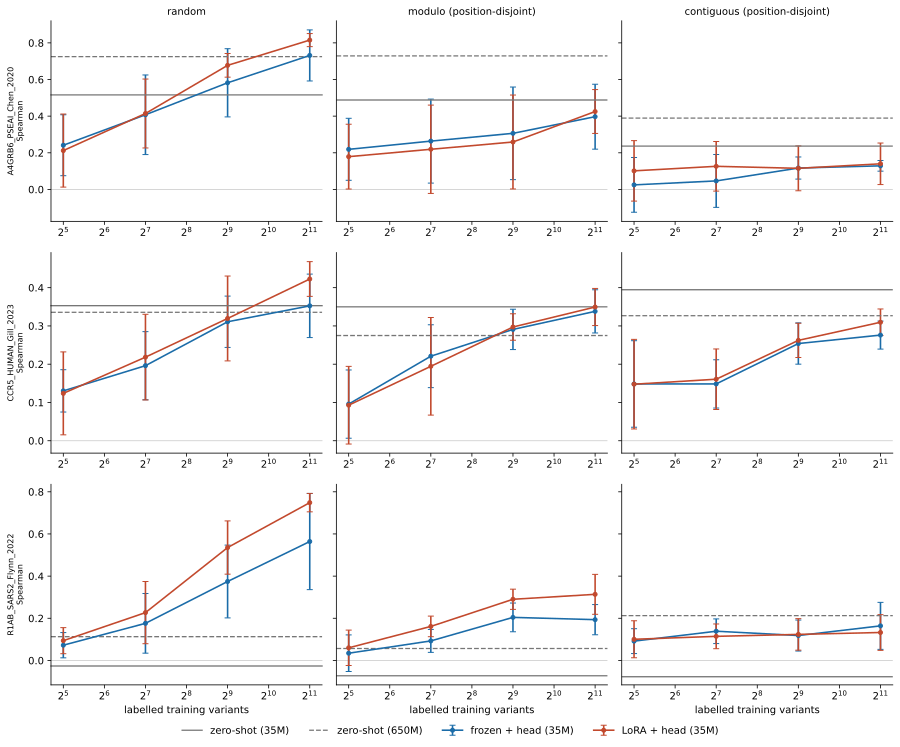
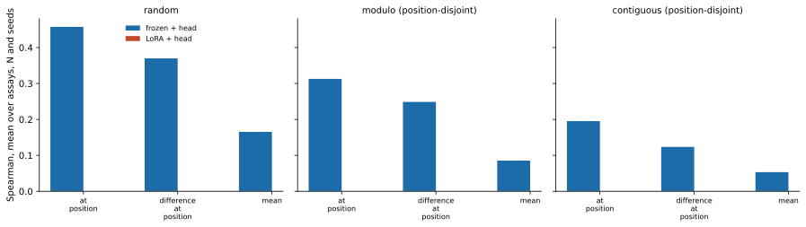

# Results

**Status:** rungs 1 and 2 complete, rung 3 pending. This page is updated as
they land, and says plainly which numbers exist.

See [Method](method.md) for the design and the
[appendix](../appendix.md) for the machinery it assumes.

## Rung 1: the pretrained prior, no labels

Spearman rank correlation on the held-out fold, ESM-2 masked-marginal scoring
with no gradient updates.

| assay | scheme | 35M | 650M |
|---|---|---:|---:|
| `A4GRB6_PSEAI_Chen_2020` | random | 0.516 | 0.725 |
| | modulo | 0.488 | 0.729 |
| | contiguous | 0.237 | 0.389 |
| `CCR5_HUMAN_Gill_2023` | random | 0.353 | 0.336 |
| | modulo | 0.350 | 0.275 |
| | contiguous | 0.395 | 0.327 |
| `R1AB_SARS2_Flynn_2022` | random | −0.026 | 0.113 |
| | modulo | −0.073 | 0.057 |
| | contiguous | −0.077 | 0.213 |

### The implementation is validated against the published benchmark

ProteinGym publishes per-assay zero-shot Spearman for every ESM-2 size. On the
`random` scheme, which is closest to scoring the whole assay, this pipeline
reproduces those numbers:

| assay | published, 35M | measured, 35M | published, 650M | measured, 650M |
|---|---:|---:|---:|---:|
| `A4GRB6_PSEAI_Chen_2020` | 0.528 | 0.516 | 0.738 | 0.725 |
| `CCR5_HUMAN_Gill_2023` | 0.358 | 0.353 | 0.347 | 0.336 |
| `R1AB_SARS2_Flynn_2022` | −0.026 | −0.026 | 0.105 | 0.113 |

The published figures cover the whole assay while these cover a fifth of it, so
exact agreement is not expected; the point is that nothing is off by a sign, a
scale, or a residue. This is the only external check the design has, which is why
it was run first.

### Three assays, three different priors

The cohort turned out to span the range, which was not designed and is useful.

**`A4GRB6`, a beta-lactamase: the prior is strong and scale helps a lot.** 0.52 at
35M rising to 0.73 at 650M. This is the regime protein LMs are usually presented
in.

**`CCR5`, a chemokine receptor: the prior is moderate and scale does nothing.**
About 0.35 at both sizes, and at two of three schemes 650M is *worse* than 35M.
Nineteen times the parameters buys nothing here.

**`R1AB`, the SARS-CoV-2 main protease: the prior is absent.** −0.03 at 35M, and
still only 0.11 at 650M. ProteinGym's published table shows it does not become
useful until 3B (0.498). At the ladder's checkpoint size, rung 1 for this assay is
a floor of nothing.

That last case is worth keeping rather than replacing. An assay where the prior
contributes nothing is the cleanest possible test of what labels alone buy, and it
was chosen by a pre-registered rule before any of this was known. Swapping it out
now, having seen these numbers, would be selection on outcome.

It is also a caution about the headline. "Fine-tuning beat zero-shot" is a much
weaker claim when zero-shot was at zero to begin with, and reporting all three
assays separately rather than averaging is what keeps that visible.

### Scale is not monotone

Worth stating because it is easy to assume otherwise: 650M beats 35M on
`A4GRB6` by a wide margin, loses to it on `CCR5` at two schemes out of three, and
helps on `R1AB` without reaching usefulness. Whatever a bigger prior buys depends
on the protein, not on the parameter count.

## Rung 2: what supervision buys at a fixed representation

324 arms: three assays, three schemes, three readouts, four label counts, three
seeds. Twenty minutes on the laptop, most of it the one-off embedding pass.

Spearman by label count, averaged over readouts and seeds, with the 35M zero-shot
floor beside it:

| assay | scheme | N=32 | N=128 | N=512 | N=2048 | zero-shot |
|---|---|---:|---:|---:|---:|---:|
| `A4GRB6` | random | 0.227 | 0.367 | 0.520 | **0.734** | 0.516 |
| | modulo | 0.218 | 0.262 | 0.310 | 0.357 | **0.488** |
| | contiguous | 0.022 | 0.024 | 0.015 | 0.024 | **0.237** |
| `CCR5` | random | 0.123 | 0.210 | 0.309 | **0.367** | 0.353 |
| | modulo | 0.121 | 0.228 | 0.292 | 0.348 | 0.350 |
| | contiguous | 0.168 | 0.157 | 0.234 | 0.241 | **0.395** |
| `R1AB` | random | 0.068 | 0.155 | 0.346 | **0.577** | −0.026 |
| | modulo | 0.027 | 0.114 | 0.207 | **0.202** | −0.073 |
| | contiguous | 0.098 | 0.149 | 0.129 | **0.147** | −0.077 |

### Supervision beats the prior only where the test sites were seen

This is the headline, and it is not the comfortable result.

On `random`, where training and test share almost every residue position,
supervision climbs steeply and overtakes zero-shot on all three assays. On the
two position-disjoint schemes it mostly does not. `A4GRB6` under `modulo` reaches
0.357 against a zero-shot floor of 0.488; under `contiguous` it sits at 0.02
against 0.237. `CCR5` under `contiguous` reaches 0.241 against 0.395.

The exception is `R1AB`, where supervision wins under every scheme, because the
prior is at zero and anything clears it.

Read together: **2,048 labels are worth a great deal when you already have data at
the sites you care about, and worth little when you do not.** A benchmark
reporting only a random split would show the first half of that and none of the
second.

### The readout mattered more than the label count

Mean over seeds at N=2048:

| assay | scheme | mean | at_position | difference |
|---|---|---:|---:|---:|
| `A4GRB6` | random | 0.548 | **0.855** | 0.800 |
| | modulo | 0.068 | **0.605** | 0.399 |
| | contiguous | −0.146 | 0.088 | **0.131** |
| `CCR5` | random | 0.259 | **0.468** | 0.374 |
| | modulo | 0.297 | **0.386** | 0.361 |
| | contiguous | 0.181 | 0.240 | **0.302** |
| `R1AB` | random | 0.281 | **0.753** | 0.696 |
| | modulo | 0.096 | **0.296** | 0.213 |
| | contiguous | 0.029 | **0.260** | 0.152 |

Mean pooling is worse in **every one of the nine cells**, often by a factor of
two or more, and on `A4GRB6` under `contiguous` it is actively negative. That is
the readout the field reaches for by default and the one this pipeline would have
used if the parameter had been given one.

This is the clearest vindication of a design decision in the project. Making the
readout a pre-registered axis rather than a knob cost three times the rung-2
compute, which was twenty minutes, and the alternative was reporting roughly half
the achievable performance while believing it was a property of protein language
models.

`at_position` wins seven cells and `difference_at_position` wins two, both under
`contiguous`. So there is no single best readout either, which is the other reason
not to have selected one.

### Site coverage, not label count, is what saturates

Each arm records how many *distinct residue positions* its training draw covered.
For `R1AB`:

| scheme | N=32 | N=128 | N=512 | N=2048 |
|---|---:|---:|---:|---:|
| random | 30 | 107 | 251 | 303 |
| modulo | 30 | 91 | 171 | **181** |
| contiguous | 30 | 96 | 172 | **181** |

The position-disjoint schemes cap at 181 sites however many labels are drawn,
because the training folds only contain that many. `random` reaches 303. That is
the mechanism behind the flat curves above: past N=512 the extra labels are
repeat measurements at sites already covered, not new sites.

Recording this was worth it. Without it, `A4GRB6` under `contiguous` sitting at
0.02 across every label count reads as a broken pipeline rather than as a model
that has seen 181 of 266 sites and cannot transfer to the remaining block.

## Rung 3

Not yet reported. Runs on SLURM, since the fine-tuned rung cannot use the
embedding cache and is the entire compute budget of the benchmark.
