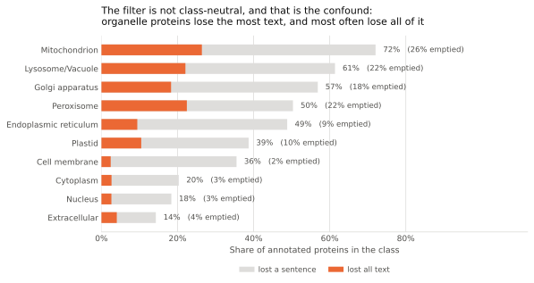

# The ablation filter: separating grounding from leakage

The free-text arm beats sequence-only by 0.124 macro-F1, and the shuffled control
shows the gain is tied to each protein's own text. Neither fact says *why* the
text helps. Two stories fit: the prose carries genuine functional information
(**grounding**), or the prose sometimes states the compartment outright and the
model is reading it (**leakage**).

This page documents the apparatus built to tell them apart: a filter that removes
localization-stating sentences from the free text, so the arm can be re-run on
prose that no longer names the answer. The numbers it produced are in
[Results](results.md#separating-grounding-from-leakage).

The filter is scientific apparatus, not a preprocessing detail, so its design
choices are argued here rather than buried in a commit. The machinery lives in
`biotp.text_ablation`; the compartment vocabulary lives beside the experiment in
`projects/grounding-multimodal/scripts/run_arms.py`, because which words state the
label depends on the task.

## The governing doctrine: prefer recall, and pay for it with a control

The two ways this filter can be wrong are not symmetric.

A **false negative**, a synonym the vocabulary misses, leaves the answer in the
text. The ablated arm then scores higher than it should, and the conclusion drifts
toward "grounding". Nothing in the experiment's own output reveals this: the run
looks identical to a successful ablation.

A **false positive**, a sentence removed that states no location, deletes real
functional content. The ablated arm scores lower than it should, which looks like
leakage. This error is *visible*, because the length-matched random control (below)
removes an equal amount of text from the same proteins. An over-aggressive filter
shows up as both arms falling together, which is readable rather than misleading.

So the vocabulary deliberately prefers recall over precision. Terms are included
when in doubt, and the control is what pays for the collateral damage.

## What the filter does

Three steps, in order.

**1. Strip database bookkeeping.** UniProt appends `{ECO:0000269|PubMed:10102577}`
evidence codes (96% of descriptions), interleaves `(PubMed:...)` citations (4,042
proteins), tags claims with `(By similarity)` (2,455 proteins), and prefixes every
entry with the constant `FUNCTION: `. None of it is biology.

The step that matters more than it looks is cleaning up afterwards. Evidence codes
usually follow a sentence-final period, so removing one leaves `"... condition. ."`
and that stray `"."` survives as a sentence of its own. A first pass without this
cleanup reported that 0.5% of proteins were emptied by the filter; the true figure
is 7.1%, and the orphan fragments were the entire difference. That statistic is the
one the ablation turns on, so the orphan-punctuation pass is load-bearing.

`(Microbial infection)` and `[Isoform 1]:` are deliberately kept: they qualify what
the sentence is about, not how well it is attested.

**2. Split into sentences.** Sentences are the unit because they are the smallest
span that reads as a claim. Semicolons split too, since UniProt uses them for
independent clauses and a finer unit removes less collateral text. Four things that
look like sentence ends are protected: known abbreviations (`e.g.` in 132 proteins,
`i.e.` in 21, `sp.`/`spp.` in 6), a single capital before a lowercase word (the
`S. cerevisiae` genus abbreviation, 3), decimal points (293), and any punctuation
inside brackets, where `(EC 1.1.1.1; EC 2.2.2.2)` would otherwise fragment.

**3. Drop every sentence matching the vocabulary**, unless the only match falls
inside an exclusion phrase.

A worked example, `P93004`, exactly as UniProt returns it:

> FUNCTION: Water channel required to facilitate the transport of water across
> cell membrane. May be involved in the osmoregulation in plants under high
> osmotic stress such as under a high salt condition.
> {ECO:0000269|PubMed:10102577, ECO:0000269|PubMed:9276952}.

After cleaning and ablation, one sentence survives:

> May be involved in the osmoregulation in plants under high osmotic stress such
> as under a high salt condition.

## The vocabulary

Ten compartment groups plus an eleventh for the verbs and signals that state a
location (`localizes to`, `transit peptide`, `targeting signal`). Regular plurals
are matched without being listed, so `peroxisome` also fires on `peroxisomes`;
irregular ones (`nuclei`, `mitochondria`) are listed explicitly. Every candidate
term was counted against the corpus before being included.

### Terms deliberately excluded, and why

These are the judgement calls a reader should be able to check. Each is measured
on the surviving text instead (see the false-negative probes below).

| Excluded | Why |
|---|---|
| bare `membrane` (1,655 proteins) | Cross-class: matches "mitochondrial inner membrane", "ER membrane", and also "membrane potential". The specific phrases are listed instead. |
| bare `matrix` (248) | One word, two compartments: "extracellular matrix" and "mitochondrial matrix". The two-word phrases are listed instead. |
| `secretion`, `secretory`, `secretory pathway` (208, 64, 59) | Describes what a protein does, not where it is. "Regulates insulin secretion" and "yeast secretory pathway" appear on Cytoplasm and Cell membrane proteins. The past participle `secreted` is locational and *is* listed. |
| bare `stroma`, `stromal` (21) | In this corpus every mention is animal connective tissue ("stromal compartments of lymphoid organs"), not the plastid compartment. Only `chloroplast stroma` is listed. |
| `cell wall` (210) | A real structure, but not one of the ten DeepLoc classes, and it appears mostly on Cell membrane proteins. |
| bare `ER` | Case-insensitive matching would make a two-letter token noise. The `ER lumen` / `ER membrane` / `ER stress` phrases are listed instead. |
| **`chromatin` (654)** | **The sharpest call.** A near-perfect Nucleus indicator, but it names a *substrate*, and "chromatin remodeling" is exactly the functional prose the grounding hypothesis is about. Filtering it would remove the finding along with the leak. It is measured, not cut. |

### Exclusion phrases

A sentence is kept only when an exclusion accounts for *all* of its matches, so
"the nuclear receptor is retained in the nucleus" is still removed. Every entry is
a deliberate false negative, the dangerous direction, so the list is short and each
phrase is tested by name in `tests/test_run_arms.py`.

`nuclear receptor`, `nuclear factor`, `nuclear hormone receptor`, `cytoplasmic
tail`, `cytoplasmic domain`, `cytoplasmic side`, `cytoplasmic face`, `cytoplasmic
dynein`.

These are protein-family and topology names. "Reductase required for adipogenesis
and activation of PPARG nuclear receptor" describes an Endoplasmic reticulum
protein, and "binding to specific nuclear receptors" appears on a Cell membrane
protein.

## How much text the filter takes

Over the 12,626 annotated proteins:

| | |
|---|---:|
| Proteins losing at least one sentence | 3,867 (30.6%) |
| Sentences removed | 6,273 of 46,361 (13.5%) |
| Characters retained across the corpus | 83.6% |
| Median per-protein retention | 100% |
| 10th-percentile per-protein retention | 25.8% |
| **Proteins left with no text at all** | **900 (7.1%)** |

This is a trim, not a corpus deletion: the median protein loses nothing, and most
of the loss is concentrated in a minority of entries.

*The filter removes text from 72% of Mitochondrion proteins and 14% of
Extracellular ones. The orange segment is the share left with no text at all.*{: .figure-caption }

### Why this makes the random control mandatory

The removals are sharply class-skewed, and so are the empties: Mitochondrion 26.4%
emptied, Peroxisome 22.4%, Lysosome/Vacuole 22.1%, against Cytoplasm 2.6% and
Nucleus 2.6%.

`biotp.embeddings.embed_texts` maps empty text to a zero vector, deliberately, so a
protein with no annotation cannot be handed a learnable "missing" feature. The
consequence here is that the ablated arm receives zero vectors disproportionately
in exactly the rare compartments where the text gain was concentrated. That is a
handicap with nothing to do with leakage, and it pushes the result toward the
leakage conclusion.

The fix is a **length-matched random-sentence control**: for each protein, remove
the same *number* of sentences the ablation removed, chosen at random. It empties
the same proteins, distributes the same zero vectors, and removes a comparable
volume of text (85.1% character retention against the ablation's 83.6%). What is
left between the two arms is the compartment vocabulary and nothing else.

Comparing the ablated arm against the *unfiltered* arm confounds "removed the
answer" with "removed text". Comparing it against this control does not. The
[results](results.md#separating-grounding-from-leakage) show the distinction was
worth the two extra arms: most of the drop is volume, not leakage.

The per-protein draw is seeded from the accession via SHA-256 rather than the
builtin `hash`, which is salted per process; a salted seed would redraw the control
on every run and silently invalidate the text cache.

## Measuring what the filter missed

A vocabulary only finds synonyms someone thought of, so the false-negative rate is
probed three ways, at three resolutions.

**1. A hand-labeled fixture (unit level).** 23 localization-stating sentences and
23 non-locational ones, all quoted from the corpus, in `tests/test_run_arms.py`.
Recall is asserted at exactly 1.0, and each negative is asserted separately because
each encodes one design decision from the table above.

**2. The sentinel probe (which words).** After filtering, the surviving text is
scanned for the deliberately-excluded vocabulary. Residual mentions, as a share of
the 12,626 annotated proteins:

| Term | Proteins still mentioning it |
|---|---:|
| `membrane` | 670 (5.3%) |
| `chromatin` | 581 (4.6%) |
| `intracellular` | 289 (2.3%) |
| `microtubule` | 280 (2.2%) |
| `cell wall` | 195 (1.5%) |
| `nucleosome` | 194 (1.5%) |

These are the honest bound on what the ablation leaves behind. Full counts are in
`projects/grounding-multimodal/results/ablation_all.json`.

Two caveats on reading that file. Nested terms double-count, so `secretory` and
`secretory pathway` both fire on the same sentence. And the bare `ER` count is the
least trustworthy of the set, for the same reason `ER` was kept out of the filter:
matching is case-insensitive, so a two-letter token picks up whatever happens to
look like it. Treat that row as a loose upper bound rather than a measurement.

**3. The text-only ablated arm (any residual signal).** This is the strongest of
the three and costs nothing, because the arm is in the table anyway. A word list
finds only enumerated synonyms; a classifier trained on ablated text alone finds
*any* residual signal, including phrasings nobody thought to list. It scores 0.482
macro-F1, well above the 0.291 majority floor, so the ablated prose is far from
information-free about localization. Some of that is genuine function signal and
some is residual leakage, and this arm cannot separate them, but it does bound the
claim that the filter "removed the answer": it did not remove all of it.

## Versioning

The lexicon carries `ABLATION_LEXICON_VERSION`, currently 1. The embedding cache
invalidates on its own when the lexicon changes, because the filtered strings
change and the cache key hashes its inputs; but the *reported statistics* would
change silently, so the version exists to make a decision-log entry citable. It
plays the same role for the vocabulary that `EMBEDDING_IMPL_VERSION` plays for the
embedding code.

No `EMBEDDING_IMPL_VERSION` bump was needed for this work. The filter runs upstream
of the encoder and this change does not touch `biotp/embeddings.py`, so the four
new text variants land in their own cache files under keys that differ by their
inputs. `test_cache_key_is_stable_for_the_recorded_spec` passed unmodified, which
is the evidence that the embedding code really was untouched.
