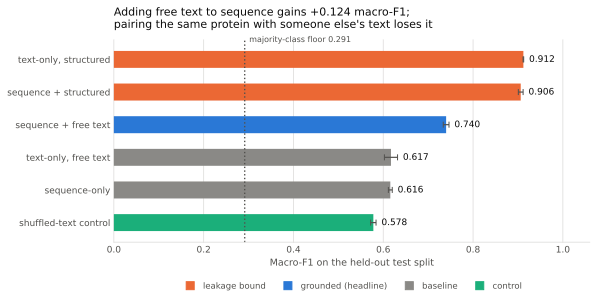
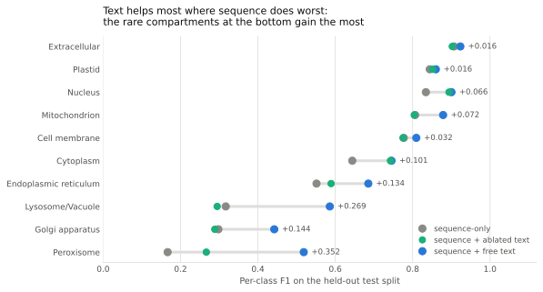
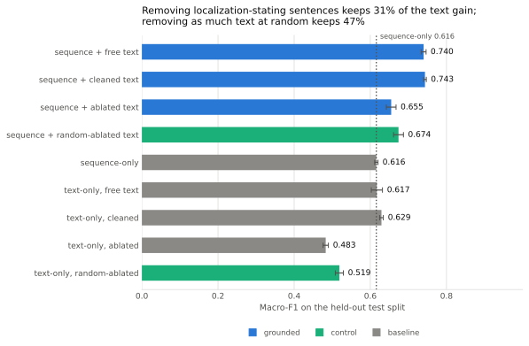

# Results: does language grounding help?

**Short answer: yes, mostly, and about an eighth of it is leakage.** Adding
free-text function annotations to a frozen ESM-2 representation improves macro-F1
from 0.616 to 0.740 on held-out proteins, and pairing each protein with a
*different* protein's text destroys the gain, which rules out the boring
explanation.

Ablating the sentences that name a compartment costs 12% of that gain, so the
prose is partly reading the answer. A further 56% turns out to depend simply on
having the full annotation, which only a length-matched random control could
reveal. See [Separating grounding from
leakage](#separating-grounding-from-leakage).

The separate structured-annotation arm shows what blatant label leakage looks
like, and it scores far higher still. See [Interpretation](#interpretation).

Produced by the runs of 2026-07-30 21:55 UTC (six arms) and 2026-07-31 14:37 UTC
(the ablation arms); provenance in
`projects/grounding-multimodal/results/run_manifest_all.json` and
`ablation_all.json`. The original six arms reproduced bit-for-bit in the later
run, which is what licenses reading the two together.

## Headline

2,773 held-out proteins from DeepLoc's homology-partitioned test split. Mean over
3 seeds, standard deviation across seeds. Majority-class accuracy floor: 0.291.
Macro-F1 is the metric to read, since the classes are 26-fold imbalanced and it
weights every compartment equally regardless of size; it is defined, with the
other metrics here, in [Method](method.md#definitions).

| Arm | Accuracy | Macro-F1 | Balanced acc. |
|---|---:|---:|---:|
| sequence-only | 0.755 ± 0.004 | 0.616 ± 0.004 | 0.599 ± 0.004 |
| text-only, free text | 0.690 ± 0.005 | 0.617 ± 0.015 | 0.585 ± 0.010 |
| text-only, structured | 0.936 ± 0.001 | 0.912 ± 0.001 | 0.899 ± 0.003 |
| **sequence + free text** | **0.835 ± 0.007** | **0.740 ± 0.006** | **0.716 ± 0.009** |
| sequence + structured | 0.939 ± 0.001 | 0.906 ± 0.005 | 0.893 ± 0.005 |
| shuffled-text control | 0.737 ± 0.002 | 0.578 ± 0.006 | 0.564 ± 0.004 |



*Macro-F1 per arm, error bars showing the standard deviation across 3 seeds.
Orange marks the structured arms, which bound what label leakage looks like on
this task; the control in green sits below the sequence-only baseline.*{: .figure-caption }

Three things to take from this table.

**The grounded arm beats sequence-only by 0.124 macro-F1.** Seed spread is about
0.005, so the gap is more than twenty times the noise. This is not a seed
artifact.

**The shuffled control lands *below* sequence-only**, at 0.578 against 0.616.
This is the result that makes the headline mean something. The control keeps each
protein's own sequence but hands it another protein's annotation, so it has
exactly the same 864 input dimensions and exactly the same head capacity as the
grounded arm. If the gain came merely from feeding the model more numbers, the
control would capture it. Instead the extra 384 dimensions of mismatched text are
mild noise and cost a little accuracy. The improvement is therefore tied to *this
protein's* annotation, which is the definition of grounding for this experiment.

**Free text alone matches sequence alone on macro-F1** (0.617 versus 0.616) while
scoring lower on accuracy (0.690 versus 0.755). The two modalities are roughly
comparable in information content but distribute it differently across classes,
which is consistent with them being complementary rather than redundant.

## Where the gain comes from

Per-class F1 on the all-proteins cohort, ordered by sequence-only performance:

| Compartment | Share | sequence-only | sequence+free text | Δ |
|---|---:|---:|---:|---:|
| Extracellular | 14.2% | 0.907 | 0.923 | +0.016 |
| Plastid | 5.5% | 0.844 | 0.860 | +0.016 |
| Nucleus | 29.2% | 0.834 | 0.900 | +0.066 |
| Mitochondrion | 10.9% | 0.806 | 0.879 | +0.072 |
| Cell membrane | 9.7% | 0.777 | 0.809 | +0.032 |
| Cytoplasm | 18.3% | 0.644 | 0.745 | +0.101 |
| Endoplasmic reticulum | 6.2% | 0.552 | 0.685 | +0.134 |
| Lysosome/Vacuole | 2.3% | 0.317 | 0.586 | +0.269 |
| Golgi apparatus | 2.6% | 0.298 | 0.442 | +0.144 |
| Peroxisome | 1.1% | 0.167 | 0.519 | +0.352 |



*Each row is one compartment: grey is sequence-only, blue is sequence + free
text, and the bar between them is the gain. Rows are ordered by sequence-only
performance, so the widening gaps toward the bottom are the whole finding.*{: .figure-caption }

**The gain is concentrated in the classes the sequence model handles worst**, and
those are largely the rare ones. Peroxisome roughly triples and Lysosome/Vacuole
nearly doubles. Extracellular, where sequence already scores 0.907 because
secretion signals are blatant in the N-terminus, gains almost nothing.

Per-class F1 on a class with only about 30 test proteins is a noisy statistic, so
read the rare-class rows as a pattern rather than as precise values; Peroxisome in
particular moved by more than 0.07 between two runs that differ only in the
embedding code path (see the 2026-07-30 speedup entry in `DECISION_LOG.md`).

This is a coherent story rather than a curiosity. Rare compartments give a
sequence model few examples to learn their targeting motifs from, while a curator
writing a functional description will still say what the protein does and where it
acts. Text is most useful exactly where sequence evidence is thinnest.

The shuffled control reinforces it from the other side: its worst damage is also
in the rare classes, dropping Lysosome/Vacuole from 0.317 to 0.130. Rare classes
have the least signal to spare, so they are the most sensitive both to real
information and to noise.

## The annotation-coverage question

8.9% of proteins have no free-text function annotation and receive a zero vector,
which raised the question of whether the headline should be reported on all
proteins or only on annotated ones. Both were run:

| Cohort | n test | sequence-only | sequence+free text | Δ |
|---|---:|---:|---:|---:|
| All proteins | 2,773 | 0.616 | 0.740 | +0.124 |
| Annotated only | 2,534 | 0.619 | 0.750 | +0.130 |

**The choice does not matter.** The gain is 0.124 on one cohort and 0.130 on the
other, close enough given a seed spread of 0.003 to 0.007 that the conclusion is
the same either way. Reporting the all-proteins number is therefore honest and
loses nothing.

Both rows come from `impl_version` 2 vectors: the annotated-only cohort was
re-run alongside the all-proteins one after the embedding speedup
(`results/run_manifest_annotated.json`), so the table is two runs of identical
code rather than a comparison across implementations.

One difference is worth noting: text-only rises from 0.617 to 0.664 when
un-annotated proteins are excluded, which is expected, since on the full cohort
that arm is asked to classify 239 test proteins from a zero vector. That it
affects the text-only arm but not the combined arm suggests the head learns to
lean on sequence when text is uninformative.

## Interpretation

The narrow claim is supported: **adding curated function text to a frozen
protein-sequence representation measurably improves subcellular localization, and
the improvement is specific to the protein's own text rather than an artifact of
extra input dimensions.**

The broader claim, that this constitutes grounding in biological knowledge, is
**not yet established**, and the structured arm is why.

GO terms and keywords score 0.912 on their own, close to a ceiling. Those fields
frequently contain the label verbatim: `Q9H400` is labelled Cell membrane and its
keywords literally include "Cell membrane". So that arm mostly measures the
model's ability to read an answer key, and it usefully bounds what pure leakage
looks like on this task: about 0.91.

Free text sits at 0.740, between sequence-only at 0.616 and the leakage ceiling at
0.912. That position is consistent with two different stories that this experiment
cannot yet separate:

1. Function prose carries genuine functional information that complements
   sequence, or
2. Function prose sometimes states the localization outright, and the arm is
   partially reading the answer, just less reliably than the structured fields.

Story 2 is entirely plausible. Curated descriptions routinely mention compartment
in passing: the example quoted in [data.md](data.md) contains "across cell
membrane" for a protein labelled Cell membrane. The per-class pattern does not
settle it either, since a curator is arguably *more* likely to state the location
explicitly for an unusual compartment like peroxisome, which would predict the
same rare-class concentration observed above.

That ablation has now been run, and the answer is neither story cleanly. See
[Separating grounding from leakage](#separating-grounding-from-leakage).

Two smaller observations:

- **Adding sequence to the structured arm does not help.** 0.906 with sequence
  against 0.912 without, a difference within about one standard deviation. Once
  the text contains the answer, the sequence contributes nothing.
- **Every arm clears the 0.291 majority floor comfortably**, so no arm is
  degenerate.

## Separating grounding from leakage

The interpretation above left one question open: how much of the +0.124 is the
text carrying function, and how much is it naming the compartment? To answer it,
sentences mentioning any of the ten compartments or their synonyms are removed
from the free text and the arms re-run. The filter, its vocabulary, and the
judgement calls behind it are documented in [Ablation filter](ablation.md); it
trims 13.5% of sentences and leaves 83.6% of the corpus characters.

Two extra conditions make the comparison interpretable. A **cleaned** arm strips
the `{ECO:...}` codes and `FUNCTION: ` prefix but ablates nothing, which separates
"removed the answer" from "removed the bookkeeping". A **random-ablated** control
removes the same *number* of sentences per protein, chosen at random, which
separates "removed the answer" from "removed text".

| Arm | Macro-F1 | vs sequence-only |
|---|---:|---:|
| sequence-only | 0.616 ± 0.004 | |
| **sequence + free text** | **0.740 ± 0.006** | **+0.124** |
| sequence + cleaned text | 0.743 ± 0.003 | +0.127 |
| sequence + random-ablated text | 0.671 ± 0.017 | +0.055 |
| sequence + ablated text | 0.656 ± 0.013 | +0.040 |
| text-only, free text | 0.617 ± 0.015 | |
| text-only, cleaned | 0.630 ± 0.006 | |
| text-only, random-ablated | 0.518 ± 0.011 | |
| text-only, ablated | 0.482 ± 0.008 | |



*The ablation ladder. The bar to compare the ablated arm against is the
random-ablated control directly above it, not the unfiltered arm at the top.*{: .figure-caption }

**Cleaning the evidence codes changes nothing.** 0.743 against 0.740, within one
standard deviation. This resolves the open preprocessing question flagged in
[data.md](data.md): the `{ECO:...}` markers and the constant `FUNCTION: ` prefix
were 22% of the corpus by character count, and removing them moves no arm
materially. Worth knowing, and it means the unfiltered baseline was never
contaminated by bookkeeping.

**The ablation drops the arm to 0.656, but most of that is not leakage.** Read
against the unfiltered arm alone, 68% of the gain vanishes, which looks like a
damning leakage result. Read against the length-matched control, it is not:
removing an equal number of *randomly chosen* sentences drops the arm to 0.671,
almost as far. The gain is fragile to losing text at all, because the filter takes
text disproportionately from the rare compartments where the gain was concentrated
(72% of Mitochondrion proteins lose a sentence, against 14% of Extracellular ones).

That splits the +0.124 three ways:

| Component | Macro-F1 | Share of the gain |
|---|---:|---:|
| Lost by removing 13.5% of sentences at all | 0.069 | 56% |
| Lost specifically because those sentences named the compartment | 0.015 | 12% |
| Survives both | 0.040 | 32% |

**The leakage component is small but real.** 0.015 macro-F1 is smaller than either
arm's seed spread, so the standard deviations in the table above do not settle it.
The per-seed pairing does: the ablated arm sits below the control in all three
seeds, by 0.011, 0.013 and 0.022. Seeds share a split and an initialization
stream, so the paired difference is far better resolved than the individual
spreads suggest. The sign is consistent; the magnitude is worth about one eighth
of the effect.

So, against the three outcomes the experiment was set up to distinguish:

- Not "the gain largely survives": only a third of it does.
- Not "the gain collapses to sequence-only, so it was all leakage": the collapse
  is mostly caused by removing text, and an equal-sized random removal reproduces
  four fifths of it.
- The honest answer is the third one, and it is more specific than "somewhere in
  between": **about an eighth of the free-text gain is the prose naming the
  compartment. The rest is not leakage, but neither is it robust: it depends on
  having the whole annotation, particularly for the rare classes.**

The single most useful thing the ablation produced is that middle finding, and it
is only visible because of the control. Without a length-matched comparison this
run would have been reported as "68% of the gain was leakage", which the data do
not support.

**What the ablation does not establish.** `text-only, ablated` still scores 0.482,
well above the 0.291 floor, so the filtered prose remains far from
information-free about localization. Some of that is genuine function signal and
some is residual leakage the vocabulary missed; this design cannot separate them.
The residual sentinel counts in [ablation.md](ablation.md#measuring-what-the-filter-missed)
bound it: 5.3% of surviving texts still say "membrane" and 4.6% still say
"chromatin", both deliberately left unfiltered.

## Limitations

- About an eighth of the free-text gain is label leakage, now measured rather than
  assumed. The residual is bounded but not zero: see the sentinel counts in
  [ablation.md](ablation.md).
- The ablation removes whole sentences, so it cannot separate a clause naming a
  compartment from the function claim wrapped around it. The random control
  measures the cost of that bluntness but does not avoid it.
- The random control matches sentence count, not character count. Removed
  localization sentences are slightly longer than average, so it retains 85.1% of
  characters against the ablation's 83.6%; that 1.5-point gap flatters the ablated
  arm's comparison very slightly.
- Three seeds is thin for a *ratio* like "32% of the gain survives", whose
  uncertainty is wider than either endpoint's. The per-seed sign test is what the
  leakage claim rests on, not the ratio's precision.
- One encoder pair (ESM-2 35M, all-MiniLM-L6-v2), one head configuration, one
  learning rate. No hyperparameter search, so these are not best-achievable
  numbers for any arm.
- Fusion is plain concatenation. Contrastive alignment, per `PLANNING.md`, is
  untried.
- The train/validation boundary is not family-grouped, so model selection may be
  mildly optimistic. Test numbers come from DeepLoc's homology-partitioned split
  and are unaffected.
- The headline arm is still fed text as UniProt returns it, including `{ECO:...}`
  evidence codes and the `FUNCTION: ` prefix. That is now a measured choice rather
  than an untested one: the cleaned arm scores 0.743 against 0.740, so the codes
  cost nothing and the committed baseline stays comparable to earlier runs.

## Cost and reproduction

| Step | Time |
|---|---|
| Embedding 13,858 sequences (ESM-2 35M, MPS) | 1,257s (~21 min) |
| Embedding free text and structured text | 31s + 41s |
| Embedding the four ablation text variants | ~100s total |
| 36 arm-seed fits on cached vectors | ~90s total |
| Full run | 1,381s (~23 min) |
| Adding the ablation, sequence vectors served from cache | **~200s** |
| Re-run on a second cohort, all caches hit | **~98s** |

The 44-second second run is the caching design working as intended: the expensive
step is paid once and every later question is cheap.

Sequence embedding used to be the whole cost, at 6,024s and 2.3 sequences/second
([#3](https://github.com/zorian15/bio-transformer-portfolio/issues/3)). Batching
by length rather than in dataset order, so a batch is not padded to the longest
protein in an arbitrary slice of the dataset, took it to 1,257s and 11.0
sequences/second: 4.8x on that step and 4.5x on the full run. Padded residue slots
over the cohort fell from 12.2M to 6.571M against 6.568M actual residues, which is
essentially no padding at all.

Those wall-clock figures compare the pipeline before and after, which also
re-tuned the batch size from 16 to 8; holding batch size fixed, the code change
alone measures about 3x. The details, including why the other two hypotheses in #3
were wrong, are in the 2026-07-30 speedup entry of the
[experiment log](decision-log.md).

```bash
python projects/grounding-multimodal/scripts/prepare_data.py
python projects/grounding-multimodal/scripts/run_arms.py
python projects/grounding-multimodal/scripts/run_arms.py --annotated-only
```
